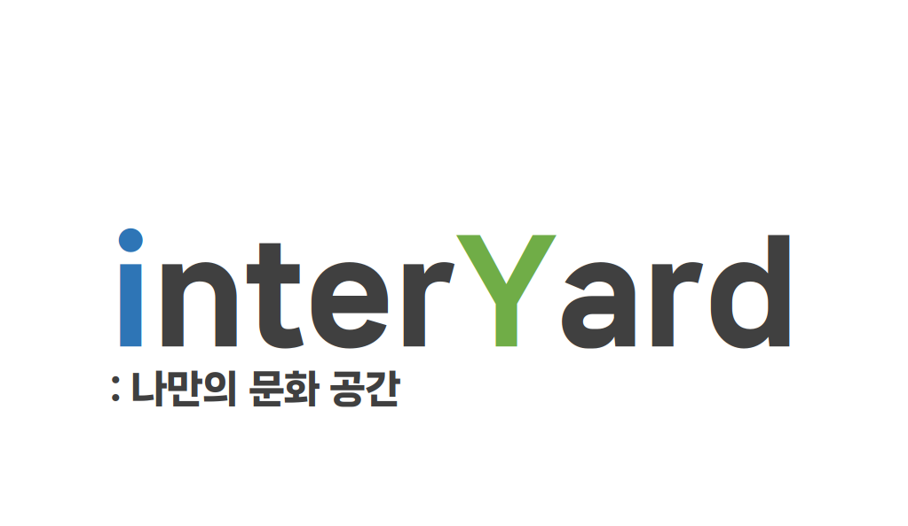

# interYard

  

# 프로젝트 소개

이 프로젝트는 포트폴리오 목적으로 제작된 도서, 티켓, 각종 상품을 판매하는 가상 쇼핑몰입니다. 

실제 서비스를 염두에 두기보다는, 다양한 기능을 구현하고 풀스택 개발 역량을 보여주기 위해 개발되었습니다.

프로젝트는 Servlet과 JSP를 사용하여 프론트엔드와 백엔드를 전반적으로 개발하였으며, 

2024년 7월 19일부터 2024년 8월 5일까지 18일간 진행되었습니다.

# 팀원 소개

+ 팀장(황문성) : 상품 관리 개발
+ PM(원필재) : 후기 / QNA / FAQ 개발
+ PM(이이섭) : 중고장터 / 댓글 개발
+ PL(윤해연) : 메인 페이지 / 공지사항 / 이벤트 개발
+ __PL(박근태) : 장바구니 / 주문관리 개발__
+ DBA(전희원) : 회원 관리 개발
+ 서기(지유빈) : 메세지 개발

# 개발 환경

| 자원분류 | 자원 이름 |
| :---: | :---: |
| OS | window 10/11 |
| IDE | Eclipse |
| DBSM | Oracle 11g |
| WAS | Tomcat9 |
| JAVA Version | JAVA17 |

# 기술 스택

  
  
  
   
  
  
    
    

# 화면 구성

### 장바구니
  
